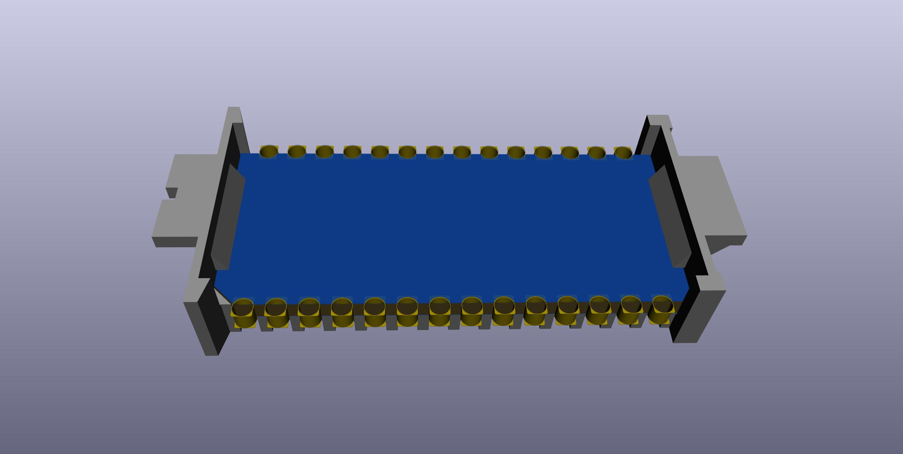
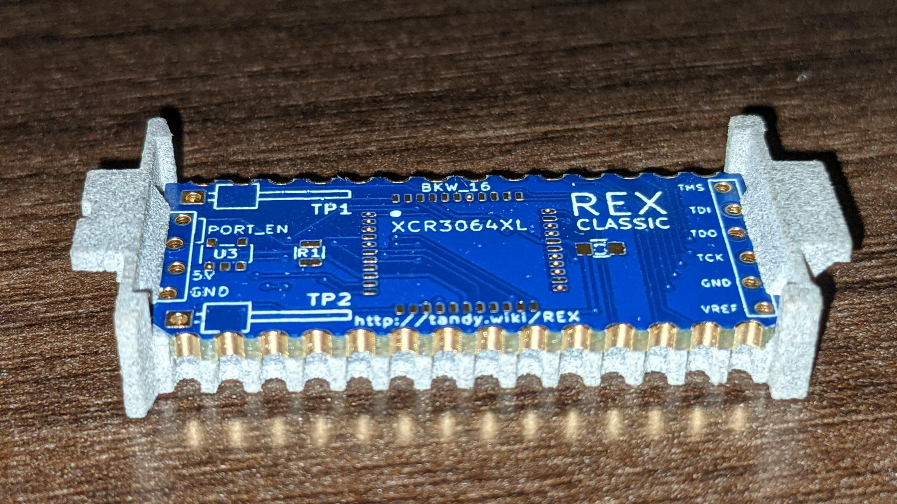
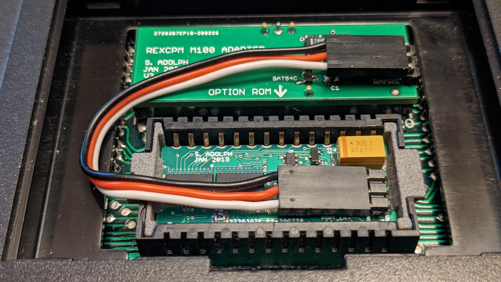
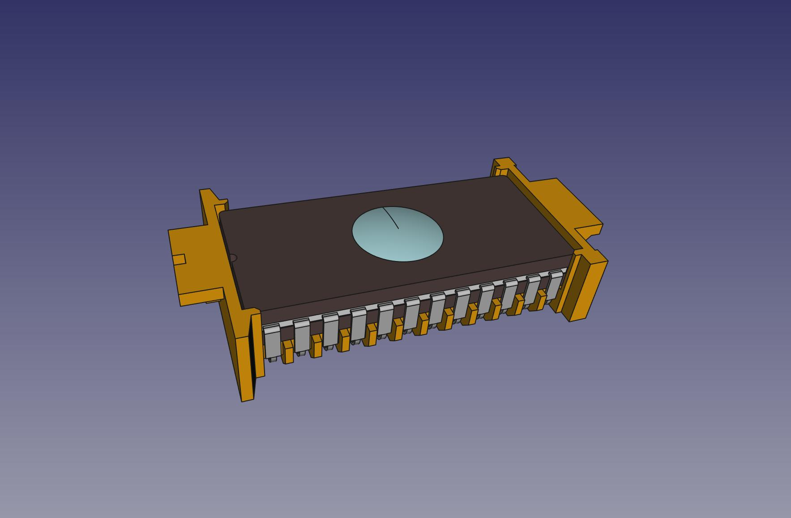
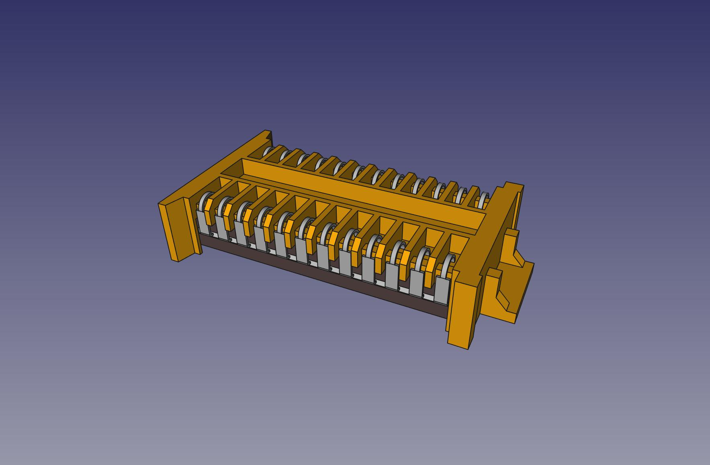
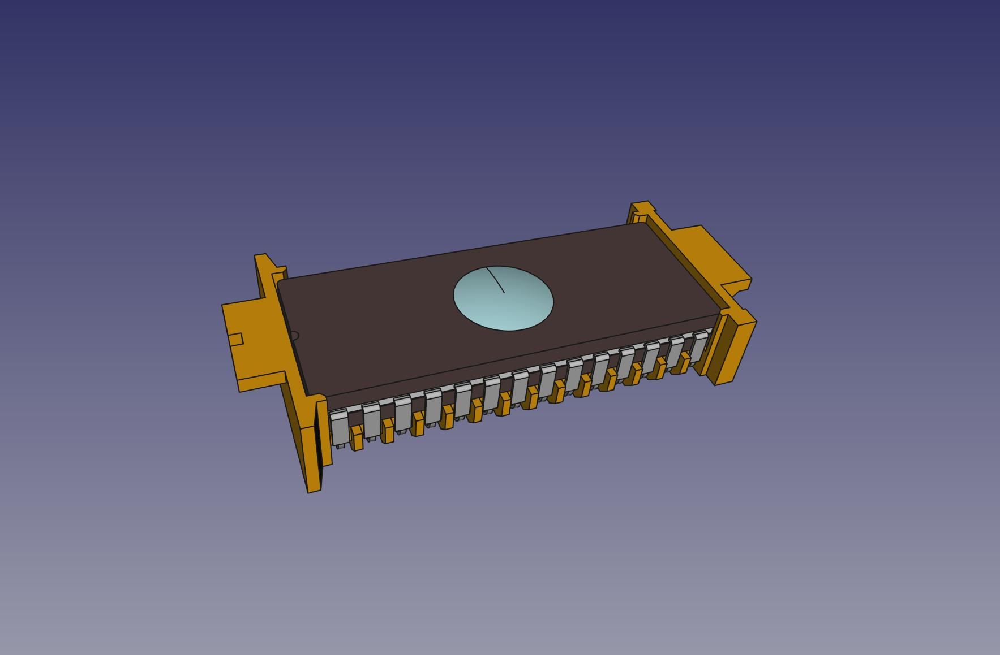
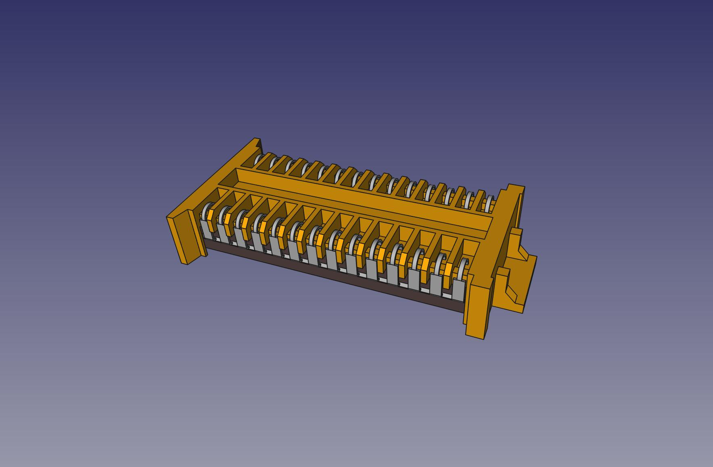
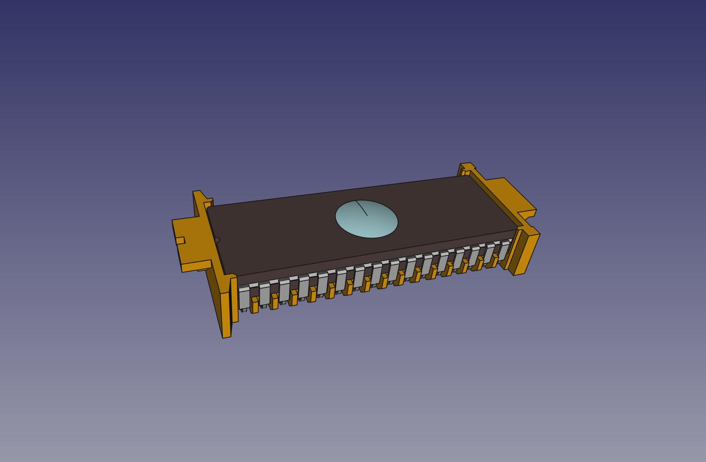
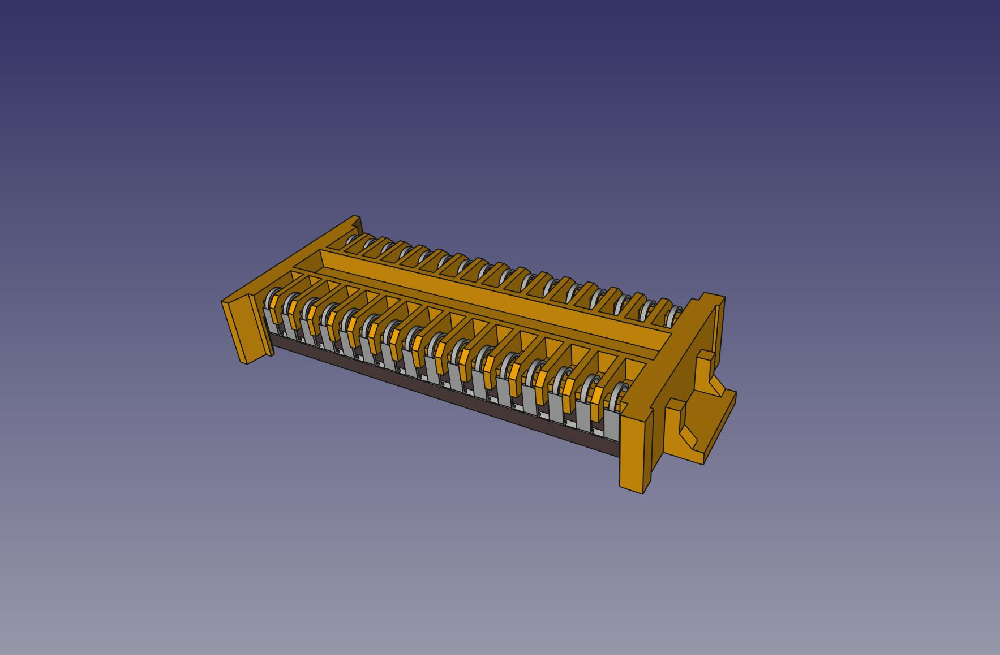
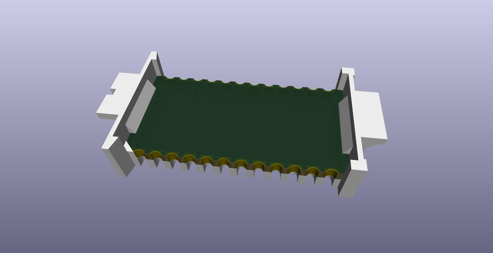

# Molex78802 Module

(The copper rings are just a flaw in KiCAD's 3d viewer. The PCB sides are actually castellated.)

***May 19 2021 - Heads up, the PCB outline changed slightly after [v003](https://github.com/bkw777/Molex78802_Module/tree/v003). The PCB is a little wider now. Old boards will be a little loose side-to-side in new carriers, and probably the polarity chamfer won't prevent inserting an old board backwards in a new carrier. New boards won't fit into old carriers, although the difference is small enough that you could just sand the corners down a little and they should work fine. If you have either old carriers or old boards that you want to get the exact matching counterparts for, then go to [Release v003](https://github.com/bkw777/Molex78802_Module/releases/tag/v003).***

This is a 3d-printable carrier similar to Molex 78802, to fit into a Molex 78805 socket, and a PCB template to use in place of a DIP chip.

The OpenSCAD file generates 2 types of carrier, one type that holds a DIP chip like a normal Molex 78802, and a different form that holds a PCB instead of a DIP.

The KiCAD files are for the matching PCB with the special board outline and castellated edge contacts to fit the PCB carrier. The pcbs are empty starter templates. Copy the entire PCB directory to a new project and rename the kicad_pcb file to a new name to start a new pcb.

Each of those are also available in 24, 28, and 32-pin sizes, as the original Molex 78802 & 78805 were. ([references/050395288_sd_corrected.pdf]())  
Though almost everything uses the 28-pin.

Uses:
* TRS-80/TANDY Model 100, 102, 200, 600
* Epson PX-4, PX-8
* Intermec 9440, Telexon 710, and various other similar hand-held teriminals
* RB5X robot (24-pin!)

http://tandy.wiki/Molex78802_Module  
http://tandy.wiki/Teeprom  
http://tandy.wiki/REX  

Brian K. White - b.kenyon.w@gmail.com

## CERDIP 24  
  

## CERDIP 28  
  

## CERDIP 32  
  

## PCB 24  

## PCB 28  

## PCB 32  

