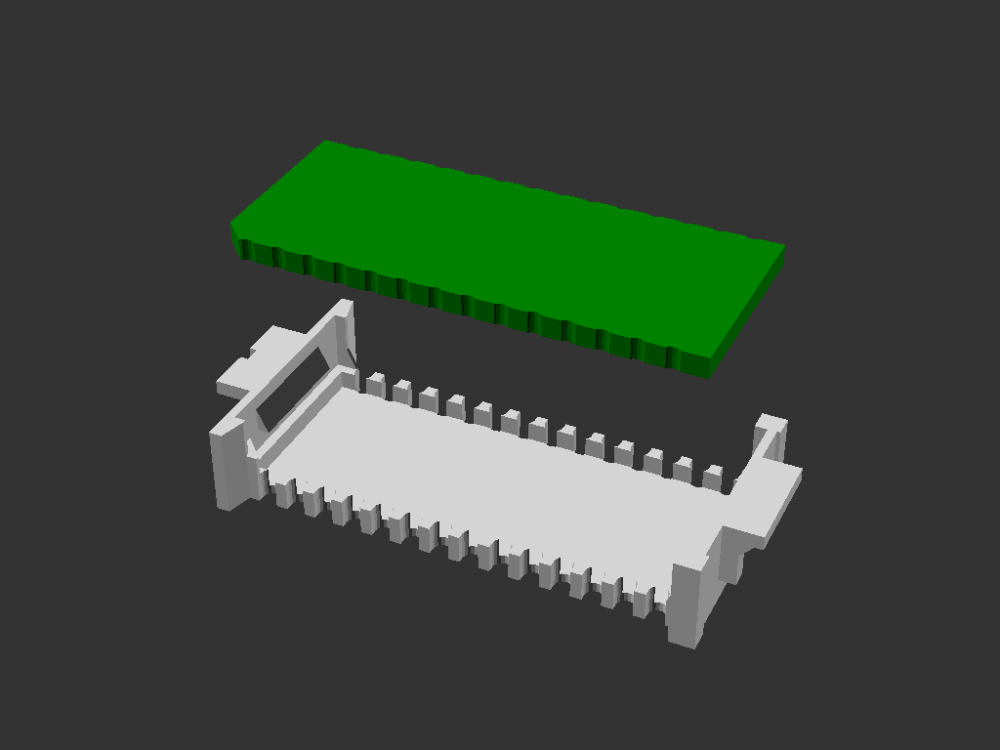
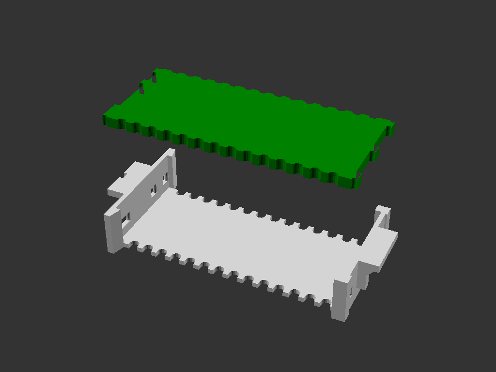
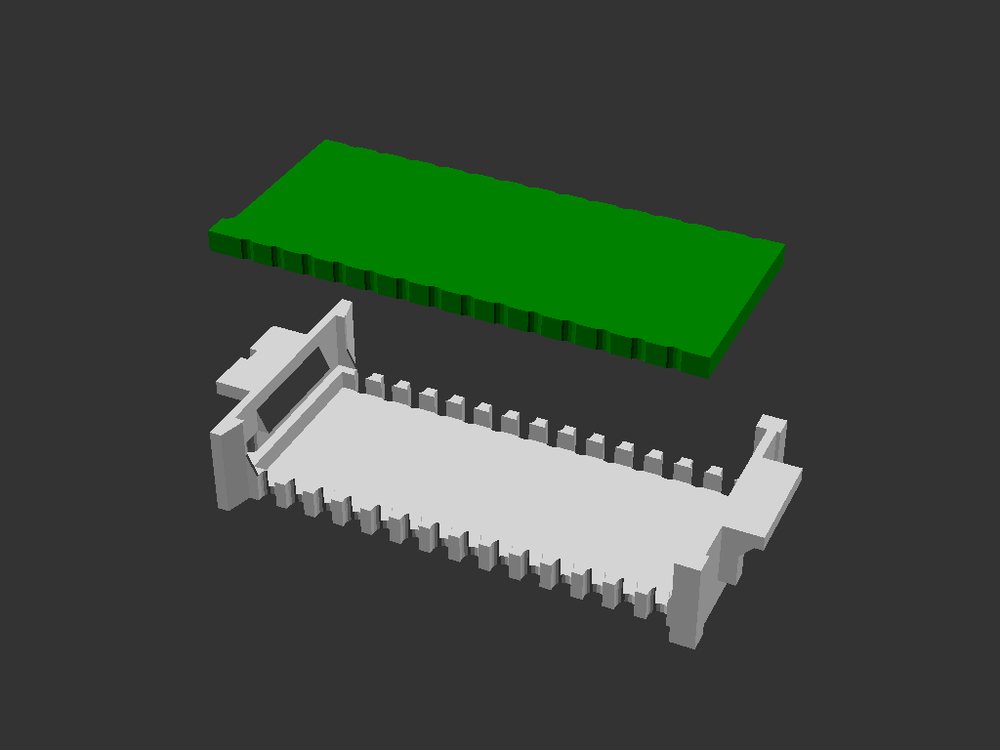

# pcb2molex8878
Matched PCB template and 3d-printable carrier to fit in the Molex DIP-28 socket found in some vintage computers.

There are a few different versions to suit different needs.

## "chamfer" version
This is the default variant.  

## "max" version
This variant provides the maximum usable pcb real-estate, on both top & bottom surfaces.  
It is not tested or proven yet.

## "bump" version

## "pin" version

## more info
http://tandy.wiki/pcb2molex8878  
http://tandy.wiki/Teeprom  
http://tandy.wiki/REX  

Brian K. White - b.kenyon.w@gmail.com
