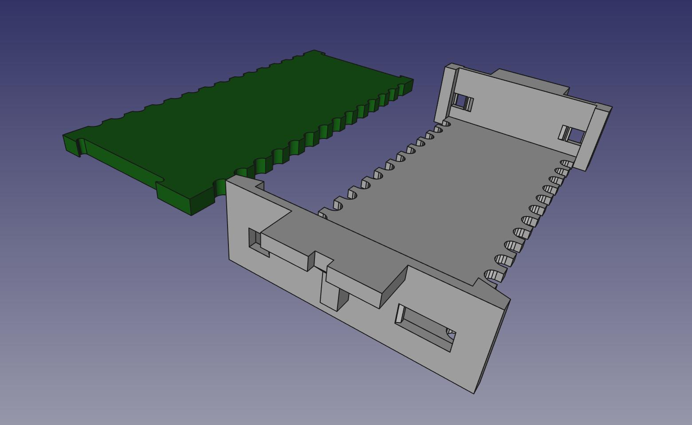

# pcb2molex8878 - "max" version
PCB and 3d-printable model to fit in the Molex 8878 DIP-28 socket found in some vintage computers.

This variant maximizes the usable pcb real-estate, on both top & bottom surfaces.  
https://photos.app.goo.gl/dKxuP3g76Du1FV3n8

https://photos.app.goo.gl/zynHU4LSpd5BZBYC9

http://tandy.wiki/pcb2molex8878  
http://tandy.wiki/Teeprom  
http://tandy.wiki/REX  

Brian K. White - b.kenyon.w@gmail.com
