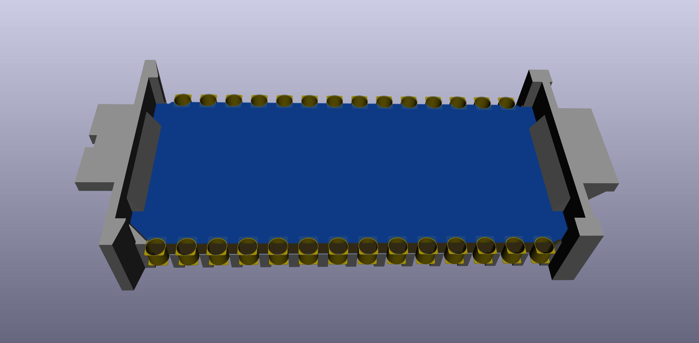

# Molex78805 PCB Module
Matched PCB template and 3d-printable carrier to fit in the Molex DIP-28 socket found in some vintage computers.

http://tandy.wiki/Molex78805_PCB_Module  
http://tandy.wiki/Teeprom  
http://tandy.wiki/REX  

Brian K. White - b.kenyon.w@gmail.com
